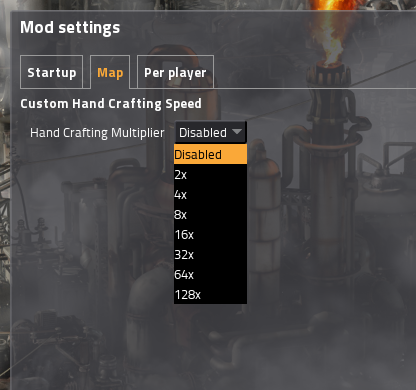

# Custom Hand Crafting Speed

## What?
Factorio mod to allow for custom hand crafting speeds.

Defaults to disabled (no modifier), but allows you to configure it anywhere from 2x (double time) to 128x (just absolutely bloody insane).

Mod can be downloaded via any of these:
- In game through the mod menu (best option)
- The [factorio mod portal](https://mods.factorio.com/mods/Othyn/Custom%20Hand%20Crafting%20Speed)
- A build can be found in the repo's `/dist` directory.

## Changelog
1.0.3:
- Updated for 0.16

1.0.2:
- Fixed bug with modifiers >=10

1.0.1:
- Added ludicrous multipliers

1.0.0:
- Initial release
